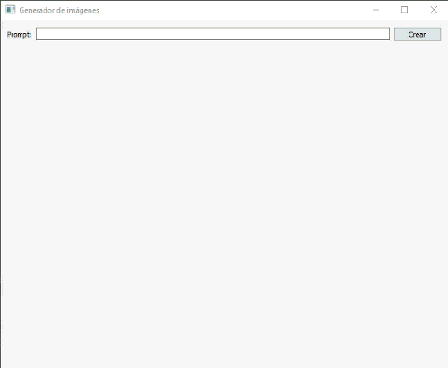

# DallE-Python
Esta es una aplicación de escritorio desarrollada con PyQt5 que permite generar imágenes a partir de un prompt (texto) utilizando la API de OpenAI. Para que este código funcione, necesitarás instalar las librerías sys, openai, requests y PyQt5:

"pip install openai", "pip install requests", "pip install PyQt5", "pip install sys"

